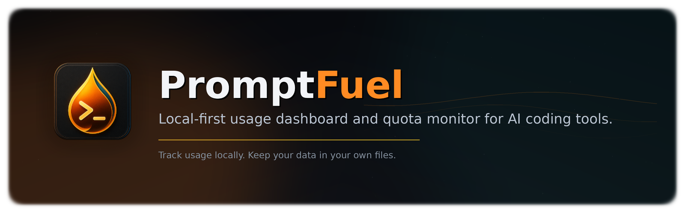
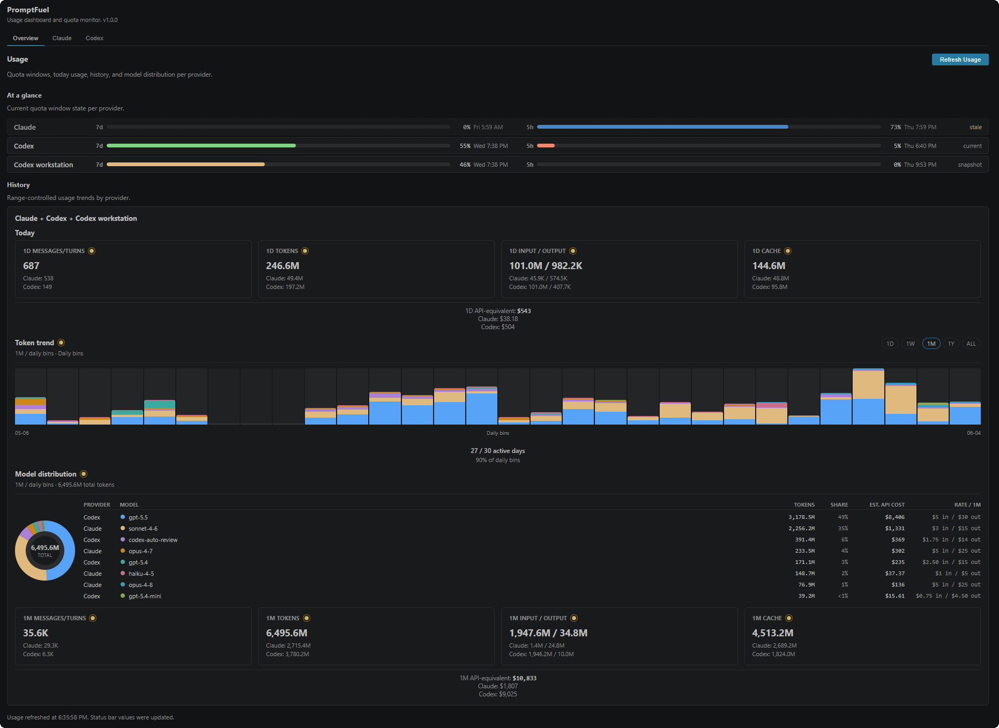
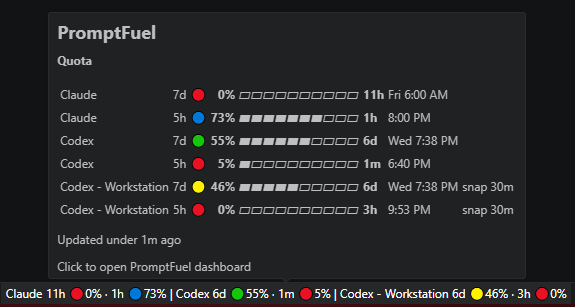
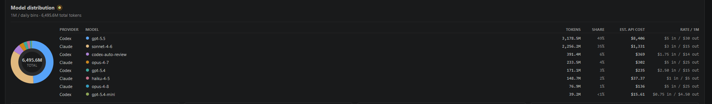

<p align="center">
  
</p>

# PromptFuel

Track AI coding assistant usage history and live quota status from the VS Code status bar.

## Features

- **Unified source configuration** — `promptFuel.sources` controls which providers and snapshot sources are enabled, their display labels, and status bar visibility.
- **Live quota first** - the status bar and dashboard prioritize live 5h/7d quota when provider auth state and provider APIs are available.
- **Status bar density** - choose the standard full-label display or compact short-label display with `promptFuel.statusBarDensity`.
- **Codex and Claude live quota support** - PromptFuel can attempt live quota reads for configured providers from existing provider auth state.
- **Safe stale states** - when a live quota refresh fails after a prior success, PromptFuel can show cached/stale quota instead of raw errors.
- **Local history secondary** - local Claude and Codex aggregate history remains visible in the dashboard and tooltip, but does not replace live quota as the primary status.
- **Dashboard tabs** - the dashboard includes Overview, Claude, and Codex tabs.
- **Combined dashboard usage by default** - Overview uses local history plus compatible machine snapshots when snapshot reading is enabled.
- **Range-driven history** - the History range controls the chart, summary cards, usage distribution, and model distribution below it.
- **Machine snapshots** - write a sanitized machine snapshot locally, optionally copy it to a shared snapshot folder, and read compatible snapshots from that folder.
- **Cross-machine imports** - automatically discover compatible snapshot files from other installs, including safe configured machine labels and provider sources.
- **Manual and auto refresh** - run **PromptFuel: Refresh Now** on demand, or use the configurable auto-refresh interval.

## Screenshots

### Dashboard overview

PromptFuel gives you one local-first dashboard for quota windows, usage history, token trends, model distribution, and API-equivalent estimates.



### Status bar quota monitor

See live quota state from the VS Code status bar, including local providers and configured snapshot sources.



### Model distribution

Break down usage by provider and model, with token share, estimated API-equivalent cost, and configured rate-per-1M values.



## Privacy & Data

- **Local history stays local.** Live quota reads may contact provider services using existing provider auth state for sources enabled in `promptFuel.sources`.
- **Sources are opt-in by individual source.** Each entry in `promptFuel.sources` can be independently enabled or disabled.
- **No raw prompts, responses, or transcripts are collected or displayed.**
- **No secrets, tokens, or API keys are stored by PromptFuel.**
- **No telemetry** is sent by PromptFuel.
- Local history parsing uses aggregate metadata only.
- Snapshot files are sanitized JSON; safe machine/source labels may be displayed, while local paths, filenames, usernames, and raw provider payloads are not product data.
- Live quota reads use existing provider OAuth state when available; PromptFuel does not provide its own auth UI.
- You can inspect PromptFuel's extension storage via **PromptFuel: Open Data Folder**.

## Commands

| Command | Title |
| --- | --- |
| `promptFuel.openDashboard` | PromptFuel: Open Usage Dashboard |
| `promptFuel.refresh` | PromptFuel: Refresh Now |
| `promptFuel.openDataFolder` | PromptFuel: Open Data Folder |
| `promptFuel.upgradeSnapshotFiles` | PromptFuel: Upgrade Snapshot Files to Current Schema |

## Machine Snapshots

PromptFuel can write a sanitized snapshot for the current machine and read compatible snapshots from a configured folder. This keeps multi-machine visibility across remote sources without exposing raw paths in the dashboard, status bar, or tooltip.

Set `promptFuel.snapshot.path` to a local or shared folder that contains compatible `*-latest.json` snapshot files. When the setting is empty, PromptFuel uses its default local snapshot/state behavior. When the setting is present, PromptFuel reads compatible snapshots from that folder and automatically discovers remote machine sources from the snapshot payloads.

Enable `promptFuel.snapshot.enabled` to write this machine's sanitized snapshot under PromptFuel's internal storage. If `promptFuel.snapshot.path` is set, the same sanitized latest snapshot and archive data are also copied to that folder. Set `promptFuel.snapshot.machineLabel` to a safe label such as `desktop`, `laptop`, `workstation`, or `build-agent`; this label is included in the snapshot payload and can appear in supported dashboard/status surfaces.

Snapshots are aggregate-only JSON files. They may contain provider quota windows, safe daily history buckets, and model breakdowns for `claude` and/or `codex`; they must not include prompts, responses, transcripts, raw provider payloads, secrets, auth tokens, local paths, usernames, or source filenames.

Minimal machine snapshot example:

```json
{
  "schemaVersion": 1,
  "writerVersion": "0.8.0",
  "generatedAtEpochMs": 1767225600000,
  "machineLabel": "desktop",
  "providerUsage": [
    {
      "provider": "claude",
      "sourceLabel": "Claude",
      "sevenDayUsedPercent": 40,
      "fiveHourUsedPercent": 20,
      "lastUpdatedEpochMs": 1767225600000,
      "stale": false,
      "source": "localSession",
      "sourceConfidence": "apiEquivalentEstimate"
    }
  ]
}
```

Malformed snapshot files, unsupported schema versions, unknown providers, private source fields, raw paths, and secret-like payloads are ignored. Snapshot recent-window totals and history buckets are used only when the snapshot provides safe compatible fields.

### Remote Machine Sources

When `promptFuel.snapshot.path` points to a shared folder, PromptFuel discovers compatible snapshots from other machines automatically. You can selectively display those remote sources in the dashboard and status bar.

**Settings:**

- `promptFuel.sources` — unified source configuration. Each key is a source ID (e.g. `claude`, `codex`, or `desktop/codex`). Controls enablement, display labels, and status bar visibility via `enabled`, `label`, `shortLabel`, and `statusBar` fields.

**Worked example:**

1. Machine **desktop** has `promptFuel.snapshot.enabled: true` and `promptFuel.snapshot.machineLabel: "desktop"`. It writes sanitized snapshots to the shared folder.
2. Machine **laptop** has `promptFuel.snapshot.path` set to the same shared folder. It discovers `desktop-latest.json` automatically.
3. On the laptop, add source entries to `promptFuel.sources` for the desktop's sources:
   ```json
   "promptFuel.sources": {
     "desktop/claude": { "enabled": true, "label": "Claude Home Desktop", "shortLabel": "CH", "statusBar": true },
     "desktop/codex": { "enabled": true, "label": "Codex Home Desktop", "shortLabel": "XH", "statusBar": false }
   }
   ```
   This shows the desktop's Claude in both the dashboard and status bar, and its Codex in the dashboard only.
4. The `label` field provides friendlier display names instead of raw machine labels.

Remote sources appear alongside local providers in the dashboard with a "snapshot-backed" indicator showing their age.

## Current Limitations

- Live quota can be unavailable when provider quota data, provider auth state, or provider endpoints are unavailable.
- PromptFuel does not include its own provider sign-in flow.
- Notifications, additional providers, in-dashboard snapshot upload, and Marketplace publish automation are not part of the MVP.
- Snapshot files are read from `promptFuel.snapshot.path`; there is no in-dashboard upload flow yet.
- Local history and snapshots are aggregate-only and may not include every provider-side detail.

## Settings

| Setting | Description | Default |
| --- | --- | --- |
| `promptFuel.sources` | Unified source configuration. Keyed by source ID (`claude`, `codex`, or `machineLabel/provider`). Each entry supports `enabled`, `label`, `shortLabel`, and `statusBar` fields. | `{ "claude": { "enabled": true, "label": "Claude", "shortLabel": "C", "statusBar": true }, "codex": { "enabled": true, "label": "Codex", "shortLabel": "X", "statusBar": true } }` |
| `promptFuel.refreshIntervalMinutes` | Minimum interval in minutes for periodic refresh (local scanning and authenticated quota). | `5` |
| `promptFuel.statusBarDensity` | Status bar label density: `standard` uses full source labels and reset countdowns; `compact` uses source `shortLabel` values and compact quota windows. | `"standard"` |
| `promptFuel.snapshot.enabled` | Enable sanitized machine snapshot writing | `false` |
| `promptFuel.snapshot.machineLabel` | Safe machine label included in snapshot payload and filename | `""` |
| `promptFuel.snapshot.path` | Optional shared folder for reading compatible snapshots and copying this machine's written snapshot | `""` |

## Development

```bash
npm install
npm run compile
```

Run unit tests:

```bash
npm run test:unit
```

Run smoke tests:

```bash
npm run smoke
```

Validate manifest:

```bash
npm run validate:manifest
```

Package VSIX:

```bash
npm run package
```

Launch Extension Development Host from VS Code's Run & Debug panel (`F5`), or:

```bash
code --extensionDevelopmentPath=.
```

## Marketplace

Marketplace publish is manual. Run `npm run package` and upload the generated `.vsix` to the VS Code Marketplace publisher dashboard.

## License

[](LICENSE)

This project is licensed under the [MIT License](https://opensource.org/licenses/MIT).

For the complete license text, see the [LICENSE](LICENSE) file in this repository.
